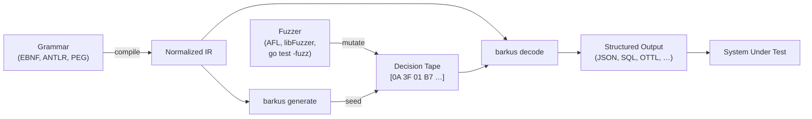

# Barkus

Structure-aware fuzzer that generates structured inputs from grammars (EBNF, ANTLR v4, PEG). Reuse your existing parser grammar to fuzz-test parsers, protocols, and file formats. The [ANTLR grammars-v4](https://github.com/antlr/grammars-v4) repository has ready-made grammars for hundreds of languages and formats.

## How it works



Barkus compiles a grammar into a normalized intermediate representation, then walks it to produce random valid outputs. Every generation decision (which alternative to pick, how many repetitions, which character in a class) is recorded onto a **decision tape** — a flat byte sequence where each decision is exactly one byte.

The intended workflow: **your fuzzer mutates the tape, and Barkus decodes it into a structured grammar output**. Seed the corpus with `barkus generate`, then let the fuzzer (AFL, libFuzzer, `go test -fuzz`, etc.) mutate the raw bytes. Because each tape byte maps to exactly one structural decision, a single byte flip changes one alternative choice or repetition count without scrambling the rest of the output. Traditional byte-level fuzzing of grammar generators suffers from the *havoc paradox* — variable-width byte consumption means one mutation cascades into a completely different parse tree. Fixed-width tape encoding solves this.

**Use it as:**

- **Rust library** (`barkus-core`) — embed generation, decoding, and mutation in your own tooling. Sans I/O: no file access, no global state, caller provides the RNG.
- **Go library** (`go/pkg/barkus`) — CGo bindings for `go test -fuzz` integration. Feed the fuzzer's `[]byte` corpus entries as decision tapes and decode them into structured grammar outputs.
- **CLI** (`barkus-cli` / `barkus-gen`) — generate samples from the command line for quick prototyping, corpus seeding, or scripted pipelines.

## Quick start

### Build

```bash
# Rust CLI
cargo build -p barkus-cli --release

# Go CLI (builds the FFI library first)
make go-example
```

### Example grammar

Point barkus at any EBNF, ANTLR v4, or PEG grammar. Here's a simple JSON example in EBNF (`fixtures/grammars/json.ebnf`):

```ebnf
start = value ;

value = object | array | string | number | "true" | "false" | "null" ;

object = "{" "}" | "{" members "}" ;
members = pair | pair "," members ;
pair = string ":" value ;

array = "[" "]" | "[" elements "]" ;
elements = value | value "," elements ;

string = "\"" chars "\"" ;
chars = char | char chars ;
char = "a" | "b" | "c" | "d" | "e" | "f" | "x" | "y" | "z"
     | "0" | "1" | "2" | "3" ;

number = digits | "-" digits | digits "." digits ;
digits = digit | digit digits ;
digit = "0" | "1" | "2" | "3" | "4" | "5" | "6" | "7" | "8" | "9" ;
```

### Generate with the Rust CLI

```bash
$ cargo run -p barkus-cli -- generate fixtures/grammars/json.ebnf --count 5 --seed 42
"d"
null
"fdxx"
true
true
```

```bash
$ cargo run -p barkus-cli -- generate fixtures/grammars/url.ebnf --count 3 --seed 42
ftp://o/?g=l&i=q&k=l&g=d&j=d&n=q&r=p&m=d&h=d
ftp://n.jn.l1:20/i7f/k/?j=e
http://rgq2:13/b/?q=b
```

### Generate with the Go CLI

The Go CLI (`barkus-gen`) uses the same FFI library and produces identical output for the same seed:

```bash
$ ./target/release/barkus-gen generate -grammar fixtures/grammars/json.ebnf -count 5 -seed 42
"d"
null
"fdxx"
true
true
```

```bash
$ ./target/release/barkus-gen generate -grammar fixtures/grammars/csv.ebnf -count 3 -seed 42
bk
"h","lh",g
gp,"d"
a,fip,lo
e,"iaj",jm
"bhp",a,o
```

### CLI flags

**Rust** (`barkus-cli`):

| Flag | Description | Default |
|------|-------------|---------|
| `<grammar>` | Path to grammar file (`.ebnf`, `.g4`, `.peg`) | required |
| `--count` | Number of samples | 10 |
| `--seed` | RNG seed (omit for random) | random |
| `--max-depth` | Max derivation depth | 30 |
| `--start` | Override start rule name | first rule |
| `--emit-tape` | Emit hex-encoded decision tapes to stderr | off |

**Go** (`barkus-gen`):

| Flag | Description | Default |
|------|-------------|---------|
| `-grammar` | Path to grammar file | required |
| `-count` | Number of samples | 10 |
| `-seed` | RNG seed (0 = random) | 0 |
| `-max-depth` | Max derivation depth (0 = default) | 0 |
| `-emit-tape` | Emit hex-encoded decision tapes to stderr | off |

## Using the Go library

```go
import "github.com/DataDog/barkus/go/pkg/barkus"

gen, err := barkus.NewGenerator(grammarSource, seed, maxDepth)
if err != nil {
    log.Fatal(err)
}
defer gen.Close()

buf := make([]byte, 64*1024)
out, err := gen.Generate(buf)
if err != nil {
    log.Fatal(err)
}
fmt.Println(string(out))
```

## SQL generation

`barkus-sql` generates random SQL queries that can reference real table and column names from your schema. It uses vendored ANTLR grammars with semantic hooks to produce syntactically valid, schema-aware output. Available dialects: **SQLite** (default), **PostgreSQL**, **Trino**, and **Generic** (ANSI).

For Go, [go-fuzz-headers](https://github.com/AdaLogics/go-fuzz-headers) provides a general-purpose `ConsumeSQLString()`, but it targets a single dialect with no schema awareness. Barkus gives you pluggable dialect grammars, custom schemas, and semantic hooks — so the generated SQL references your actual tables/columns and follows dialect-specific syntax.

See [`crates/barkus-sql/README.md`](crates/barkus-sql/README.md) for the full API reference and schema JSON format.

### Rust

```rust
use barkus_sql::SqlGenerator;
use rand::rngs::SmallRng;
use rand::SeedableRng;

let gen = SqlGenerator::new()?;                    // SQLite, synthetic schema
let mut rng = SmallRng::seed_from_u64(42);
let (sql, tape, _map) = gen.generate(&mut rng)?;
println!("{sql}");

// Replay the exact same query from the tape:
let (sql2, _) = gen.decode(&tape)?;
assert_eq!(sql, sql2);
```

Use the builder for other dialects or a custom schema:

```rust
use barkus_sql::{SqlGenerator, context::SqlContext, dialect::PostgresDialect};

let ctx: SqlContext = serde_json::from_str(schema_json)?;
let gen = SqlGenerator::builder()
    .context(ctx)
    .dialect(PostgresDialect)
    .grammar(lexer_g4, parser_g4)
    .build()?;
```

### Go

```go
gen, err := barkus.NewSQLGenerator(barkus.PostgreSQL,
    barkus.WithSchema(barkus.Schema{
        Tables: []barkus.Table{{
            Name: "accounts",
            Columns: []barkus.Column{
                {Name: "id", Type: barkus.SqlInteger},
                {Name: "email", Type: barkus.SqlText},
            },
        }},
    }),
    barkus.WithSeed(42),
)
if err != nil {
    log.Fatal(err)
}
defer gen.Close()

buf := make([]byte, 64*1024)
sql, err := gen.Generate(buf)
```

### Go fuzz test

```go
func FuzzPostgresSQL(f *testing.F) {
    gen, err := barkus.NewSQLGenerator(barkus.PostgreSQL, barkus.WithSeed(0))
    if err != nil {
        f.Fatal(err)
    }
    defer gen.Close()

    // Seed the corpus
    buf := make([]byte, 64*1024)
    for i := 0; i < 10; i++ {
        sql, err := gen.Generate(buf)
        if err == nil {
            f.Add(sql)
        }
    }

    f.Fuzz(func(t *testing.T, query []byte) {
        // Exercise your SQL parser, planner, or executor
        _ = query
    })
}
```

## Coverage visualization

`barkus-viz` generates coverage reports (text, HTML, or JSON) from both your randomly generated grammar or, if you have an existing corpus (of tape) from the directory you provide (supporting both Go fuzz file format and plain tape files).

The uniform generation is useful for two things: **validating your grammar** (can every production and alternative actually be reached?) and **tuning budget parameters** before plugging the grammar into a real fuzzer.

The tape-based corpus visualisation loading is helpful for discovering where your fuzzer struggles to cover. It's not a replacement of your code coverage visualisation but another tool in your toolbox.

```bash
# Text report to stdout
cargo run --release -p barkus-viz -- fixtures/grammars/ottl.ebnf -n 10000 --seed 42

# HTML report
cargo run --release -p barkus-viz -- fixtures/grammars/ottl.ebnf -n 10000 --format=html -o report.html

# JSON export
cargo run --release -p barkus-viz -- fixtures/grammars/ottl.ebnf -n 10000 --format=json
```

Example output (OTTL grammar, 10k payloads):

```
barkus-viz Coverage Report
Grammar: fixtures/grammars/ottl.ebnf

  Payloads:            10,000
  Failure rate:        13.91%  (1,391 failures)
    ├ max depth exceeded:      0
    └ max total nodes exceeded: 1,391
  Production coverage: 100.0%  (77 / 77 hit)

Suggested flags to reduce failures:
    --max-nodes 100000       100% of failures are max-total-nodes exceeded (current: 20000)
                             likely eliminates ~1k of 1k failures

  Full command:
    cargo run -p barkus-viz -- fixtures/grammars/ottl.ebnf --max-nodes 100000

Depth Distribution
   7 █████░░░░░░░░░░░░░░░░░░░░░░░░░░░░░░░░░░░ 798
   9 ███░░░░░░░░░░░░░░░░░░░░░░░░░░░░░░░░░░░░░ 545
  11 █░░░░░░░░░░░░░░░░░░░░░░░░░░░░░░░░░░░░░░░ 52
  ...
  31 ████████████████████████████████████████ 6435
  range: 7 – 31

Production Coverage
  Name                               Hits     Cov %  Alt distribution
  ───────────────────────────────────────────────────────────────────────
  WS                            5,592,836     85.6%  (single)
  BOOLEAN_FACTOR                1,983,609     61.1%  (single)
  BOOLEAN_PRIMARY               1,983,609     61.1%  ▓▓▓▓▓▓▓▓▓▓▓▓▓▓▓▓▓▓▓▓
  BOOLEAN_VALUE                 1,486,123     61.1%  ▓▓▓▓▓▓▓▓▓▓▓▓▓▓▓▓▓▓▓▓
  DIGIT                         1,156,622     76.9%  ▓▓▓▓▓▓▓▓▓▓▓▓▓▓▓▓▓▓▓▓
  ...
  EDITOR_INVOCATION_STATEMENT       4,881     48.8%  (single)
  WHERE_CLAUSE                      2,381     23.8%  (single)

Hard-to-Reach Analysis
  STARVED    MATH_PRIMARY alt 3
             hit 23468 times, expected ~54768 (< 50% of uniform)
  STARVED    BOOLEAN_VALUE alt 2
             hit 239144 times, expected ~495374 (< 50% of uniform)
  CHOKE      EDITOR_INVOCATION_STATEMENT
             Only reachable via __anon_46 alt 0. If that path is cold, this is unreachable.
  CHOKE      WHERE_CLAUSE
             Only reachable via EDITOR_INVOCATION_STATEMENT alt 0. If that path is cold, this is unreachable.
  ...
```

See [`crates/barkus-viz/README.md`](crates/barkus-viz/README.md) for all options.


## Development

```bash
make test        # Rust + Go tests
make test-go     # Go tests only
make ffi         # Build FFI library
make go-example  # Build Go CLI
make clean       # Clean all build artifacts
```

## Acknowledgement

The approach is inspired by research in grammar-aware fuzzing and from the overall fuzzing community, some of the references can be found:

[LibAFL](https://github.com/AFLplusplus/LibAFL) Advanced Fuzzing Library 
[Nautilus: Fishing for Deep Bugs with Grammars](https://www.ndss-symposium.org/wp-content/uploads/2019/02/ndss2019_04A-3_Aschermann_paper.pdf) (NDSS 2019) — tree-based mutations on a normalized grammar IR
[Gramatron: Effective Grammar-Aware Fuzzing](https://doi.org/10.1145/3460319.3464814) (ISSTA 2021) — depth-aware alternative selection to avoid structural bias
[GRIMOIRE: Synthesizing Structure while Fuzzing](https://www.usenix.org/conference/usenixsecurity19/presentation/blazytko) (USENIX Security 2019) — structure synthesis from byte-level mutations
[Semantic Fuzzing with Zest](https://doi.org/10.1145/3293882.3330576) (ISSTA 2019) — parametric fuzzing with byte-to-structure locality
[Zeugma: Parametric Fuzzing with Structure-Aware Crossover](https://doi.org/10.1145/3597926.3598040) (ISSTA 2023) — structure-aware crossover on decision streams
